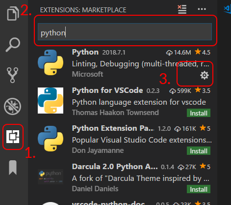

# Objectif: Avoir un environnement de développement sur vos ordinateurs perso & se remettre à la prog de base.
Hint:
- Installer Python: https://www.python.org/
- Installer Visual Studio Code: https://code.visualstudio.com/
    - Installer l'extension Python 
- Installer Git: https://git-scm.com/
- Faire 10-15 challenge de https://edabit.com/challenges
- Python Cheatsheet https://learnxinyminutes.com/docs/python3/
- Documentation officielle (beaucoup de jargon, pas forcément beginner friendly): https://docs.python.org/3/
    - Fonction native: https://docs.python.org/3/library/functions.html
    -  Type natif: https://docs.python.org/3/library/stdtypes.html
- Executer du code Python:
    - Interpreteur Python en ligne: https://repl.it/
    - Utiliser Python en mode interactif avec IDLE, l'application terminal spécialisé pour Python
    - Utiliser Python en mode interactif avec le Python installé sur votre système
        - Windows: lancer un terminal (Menu démarrer > Cmd ou Powershell), puis lancer Python avec `python` ou `py`
        - OSX: lancer un terminal (Spotlight (ou le dossier Applications) > Terminal), puis lancer Python avec `python3`
    - Executer un fichier .py avec le terminal. Note: pour afficher quelque chose dans le terminal, il faut utiliser la fonction `print(my_string)`
        - Windows: Ouvrir un terminal (Menu démarrer > Cmd ou Powershell), puis naviger vers le fichier .py (avec `dir` (ou `ls` si on utilise Powershell) et `cd`) puis executer le fichier avec `python mon_fichier.py`.
        - OSX: Ouvrir un terminal (Spotlight (ou le dossier Applications) > Terminal), puis naviger vers le fichier .py (avec `ls` et `cd`) puis executer le fichier avec `python3 mon_fichier.py`.
- Apprendre un peu Git
    - Ce que conseille Github: https://try.github.io/
    - Vous avez merdé quelque chose: https://ohshitgit.com/
    - Procédures standards: https://github.com/k88hudson/git-flight-rules

Delivrable:
- Rien; on le fait ensemble :)